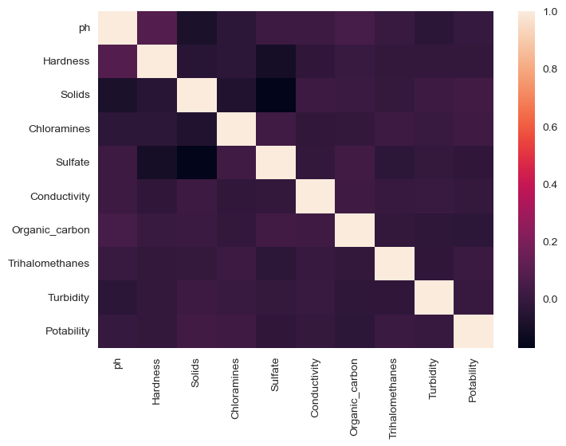
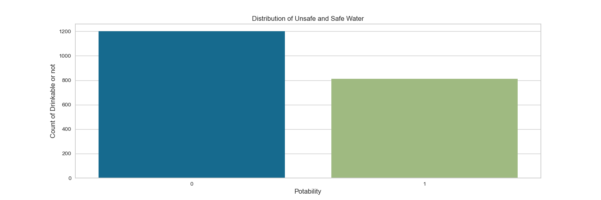

# Water Quality prediction
"It is an ML model that predicts whether your water is drinkable or not. It takes factors such as pH, hardness, etc., into consideration to determine the quality of water.

